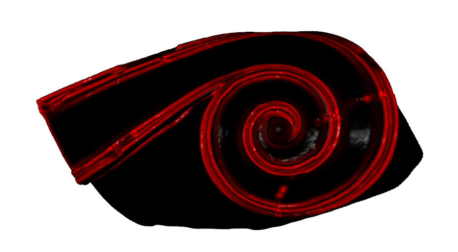

# Geometric Saliency

<br/><br/>
<div align="center">
    
</div>
<br/><br/>

## Introduction

This Jupyter Notebook is designed for students—whether undergraduate, graduate, or enthusiasts—who are diving into the fields of Computational Geometry and Geometry Processing. It offers a **practical, hands-on approach** to understanding key principles by guiding you through the implementation of a **straightforward yet effective algorithm** for detecting salient features on 3D meshes.

Throughout this notebook, you’ll work with several essential Python libraries:
- **Open3D**: A versatile toolkit for 3D data processing.
- **NumPy**: The cornerstone of numerical computation in Python.
- **Numba**: Enhances Python code performance through just-in-time compilation.
- **PyTorch**: A powerful framework for deep learning and general computation.

This notebook is crafted to help you build a solid foundation in computational geometry, with practical applications in areas like 3D shape recognition, surface analysis, and object segmentation. It’s designed to be both informative and engaging, providing a clear path to mastering these essential concepts.
 


## Requirements

I tried this with the following setup. Note that choosing different versions may not work as Open3D is still an experimental library.

```
open3d==0.17.0
torch==1.13.1 + cuda==11.6
numpy=1.24.0
tensorboard==2.14.1
```

## Acknowledgements
```
@ARTICLE{9120202,
  author={Arvanitis, Gerasimos and Lalos, Aris S. and Moustakas, Konstantinos},
  journal={IEEE Transactions on Industrial Informatics}, 
  title={Robust and Fast 3-D Saliency Mapping for Industrial Modeling Applications}, 
  year={2021},
  volume={17},
  number={2},
  pages={1307-1317},
  doi={10.1109/TII.2020.3003455}}
```
```
@inproceedings {10.2312:3dor.20201160,
booktitle = {Eurographics Workshop on 3D Object Retrieval},
editor = {Schreck, Tobias and Theoharis, Theoharis and Pratikakis, Ioannis and Spagnuolo, Michela and Veltkamp, Remco C.},
title = {{Fast Feature Curve Extraction for Similarity Estimation of 3D Meshes}},
author = {Romanelis, Ioannis and Arvanitis, Gerasimos and Moustakas, Konstantinos},
year = {2020},
publisher = {The Eurographics Association},
ISSN = {1997-0471},
ISBN = {978-3-03868-126-7},
DOI = {10.2312/3dor.20201160}
}
```
